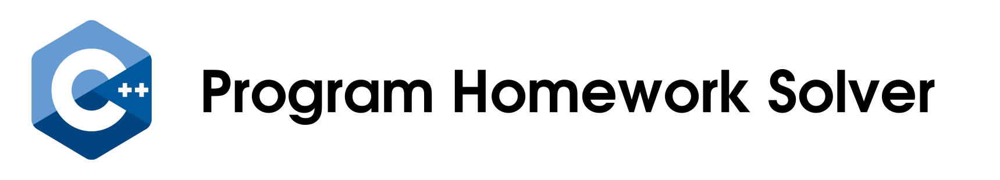

A simple command line application written in C++ that helps you **generate source code to produce a given
series of integers.** 

You provide a few terms of the series as input and the program will generate for
you, the source code in a few programming languages that prints `n` number of terms
of that particular series.

# Motivation

Ever seen questions of the kind **"Write a program that prints till the nth term of the series 1,3,5,7..."**

Thus thought automating this stuff. 

A program in which you enter any series of integers and hopefully it generates the source code you need to output that series in multiple programming languages.

The mathematical method used is **Lagranges Interpolation Method**.

## Lagranges Interpolation Method

Given a set of k + 1 data points

where no two   are the same, the interpolation polynomial in the Lagrange form is a linear combination

of Lagrange basis polynomials

Read more at [Lagrange Interpolation Method (Wikipedia)](https://en.wikipedia.org/wiki/Lagrange_polynomial)

## How to Compile and Run

Requirements : 
    * Cmake
    * make
    * GCC

> You can install these using your preferred package manager in Linux

**How to Compile:**
    * cd into the project directory 
    * run `cmake .`
    * then run `make`

The binary `program-homework-solver` will be compiled in the directory

Use `./program-homework-solver` to run the binary.

Instructions to run the Unit Tests are [here](tests/readme.md)

## DEMO

    

 

## LICENSE
Copyright (c) **Junaid Rahim**. All rights reserved.

Licensed under the [MIT](LICENSE) License

 

